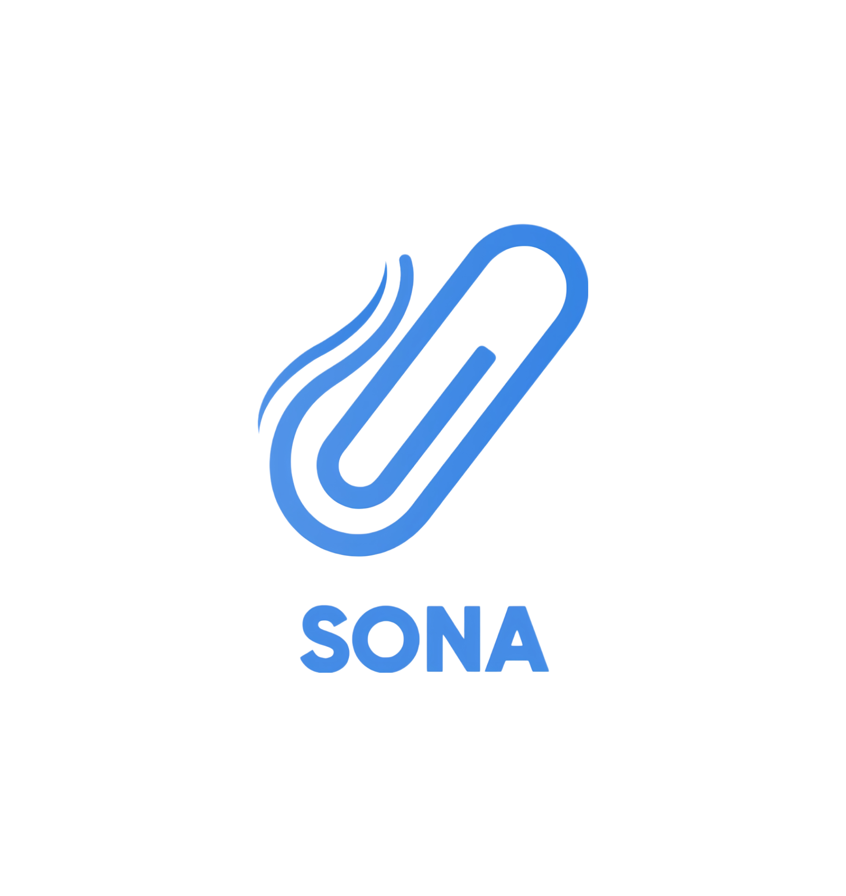

<div align="center">
  <h1>Sona</h1>
  
</div>

A modern clipboard manager built with Wails and Go.

## Screenshots
<div align="center">
  

  

  
</div>

## Features

- Real-time clipboard monitoring
- Pin important items to prevent deletion
- Edit clipboard content before copying
- Search and filter clipboard history
- Beautiful blur glass UI with theme options
- Persistent storage across sessions
- Global keyboard shortcuts (Ctrl+Shift+V)
- Cross-platform support (macOS, Windows, Linux)

## Development

### Prerequisites
- Go 1.18+
- Node.js 16+
- Wails v2 CLI

### Setup
```bash
# Clone the repository
git clone git@github.com:Prakash4844/Sona.git
cd sona

# Install dependencies
go mod tidy

# Run in development mode
wails dev

# Build for production
wails build
```

## Usage

1. Launch Sona
2. Start copying text - it appears automatically in your history
3. Click any item to copy it back to your clipboard
4. Use Ctrl+Shift+V to open/focus the window

## License

